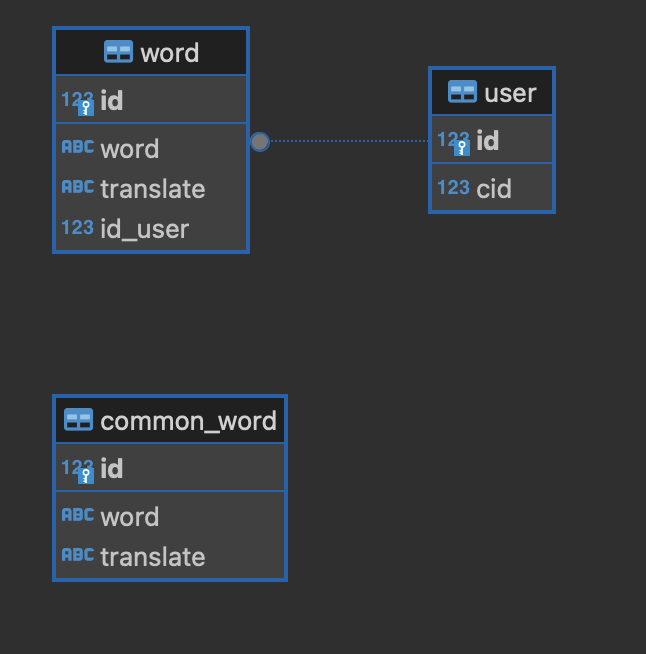

# EnglishCard-bot

## Introduction
This python script starts a Telegram bot which plays with a user a basic language card game and saves data to a PostgreSQL database.
## Prerequisites
### Python 3

This script was written for Python 3.
The script requires the following libraries (and dependencies therein).
### telebot
A library for Telegram bot API.
You can install or upgrade the telebot library with:

```
$ pip install telebot
```
### sqlalchemy
An ORM library that grants access to a database server
```
$ pip install sqlalchemy
```
### PostgreSQL
A local PostgreSQL server or access to a remote one is required. The bot uses database by the following scheme:


## Usage
### Bot's token
Bot's token is required to be put in the settings.ini [bot] section.
### DSN of a SQL server
Data source name string needs to be put in the[postgres] section of the settings.ini file.
### Create initial tables
Before using the main script a database setup scripts should be run:
```
$ python3 create_db.py
```
### Starting the bot
After all setup is done the bot can be started with:
```
$ python3 main.py
```
### Terminating the bot
You can terminate the bot by pressing Ctrl+C.
